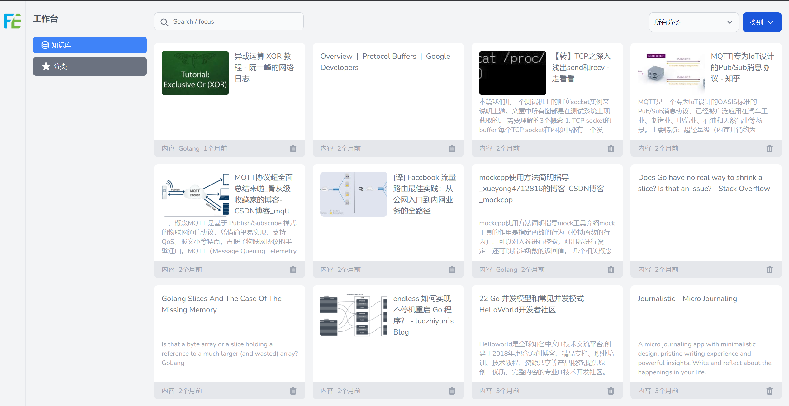
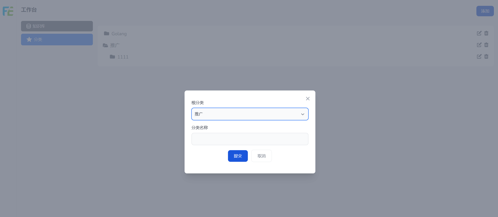

## Console

After content is added, you can manage or classify the content on the console. Currently, the operations supported are Batch Move Classification, Batch Delete, and Custom Select Classification.
