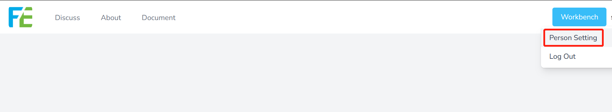

# Update Record

## 2023-01-10

### Web 0.3.1
- Fixed account invalid 500 problem
- Support Arabic language

## 2022-12-20

### Web 0.3.0
- New interface and operation updates
- Some bug fixed

### 浏览器插件 0.3.3
- Added save type selection
- Add Save Tag added
- Some bug fixed

## 2022-10-17

### Web 0.2.1
- Historical records Added to Host display
- More secure authentication
- Add link types to favorites
- Collection details page to add a personal donation channel (perseverance is not easy, if you think this site is helpful to you, please ask the author to drink a cup of coffee.)

### Browser plugin 0.2.1
- Adding link type collection
- Fix known bugs
- Click on the plugin icon to jump to the Console

## 2022-08-09

### Add a history module

For newly registered users, this feature is enabled by default. 
For registered users, you can configure the center to manually enable this feature

