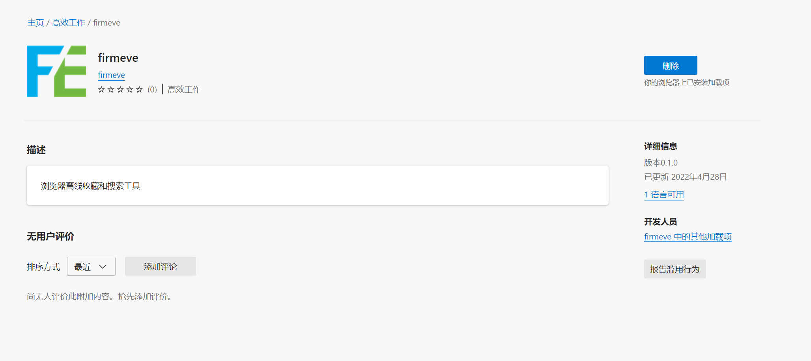

## Plugin download

**Note: After installation, if you want to save the opened page, you need to refresh the page**

### Chrome Extension

#### Chrome web store
https://chrome.google.com/webstore/detail/firmeve/mjaioceoblooamkkddmgdbcfdhneoncm

#### Manual installation 
- Click to download `Chrome package`
  

> After downloading, Chrome will have installation prompts, click trust.
>
> This plug -in is offline just to solve some users' unable to open the `Chrome store`, provided offline official bags.

- Enter `chrome://extensions/` in the chrome browser address bar and open the `developer mode`
  

- Open the downloaded `.crx` file, drag to the expansion program page, will pop up whether to add, click to add.
  
> Finally, in order to ensure safety, the browser developer mode can be turned off after successful installation.

### Edge Extension
https://microsoftedge.microsoft.com/addons/detail/firmeve/ckblicmkgpjfmljldhgogbpknbkpcgoa

Support article content, clip, picture collection

### Firefox Extension

In the review, so stay tuned!
