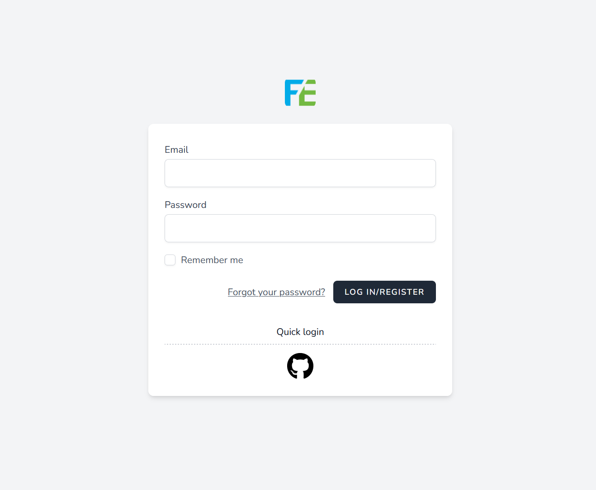

## Account password

Before using Firmeve collection Before we have to have an account, **[click login/registration](https://firmeve.com/login)** Firmeve

If you do not already have an account, Firmeve will automatically register your account and send you a verification email.

## Third-party Oauth login
Currently, the `Github` account is supported for login. If your email address is the same as the `Github` email address, and the email address has been authenticated, it will be automatically bound.

> Soon WeChat login will be launched!
