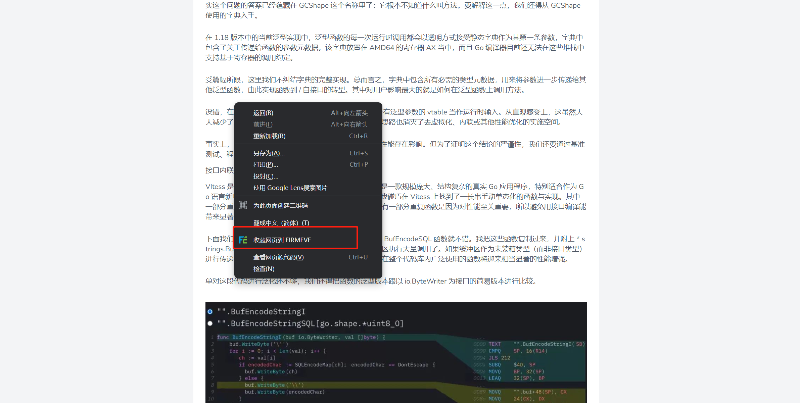

## Quickly start

With the plug-in installed, everything is ready to go let's take a quick look at how to save resources using Firmeve.
Firmeve supports resource saving of `web page`, `selection` and `image`

> For more resource types, we are tushing development, so stay tuned!

### Web content collection

First of all, we open the content of the article we need to save, and right -click to easily save.

At the same time, Firmeve has also added shortcut keys to save, and uses `Ctrl+P` by default to save the content of the webpage.

> In your personal configuration, support the modification of other shortcut keys!

### Constituency collection

In the collection of constituencies, if the constituency contains pictures, Firmeve can also easily implement the double preservation of `text+pictures`

### If we only need to collect the specified pictures, right -click on the picture to achieve the collection of the picture

If we only need to collect the specified pictures, right -click on the picture to achieve the collection of the picture

