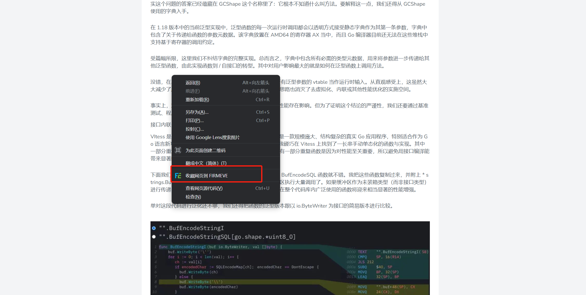
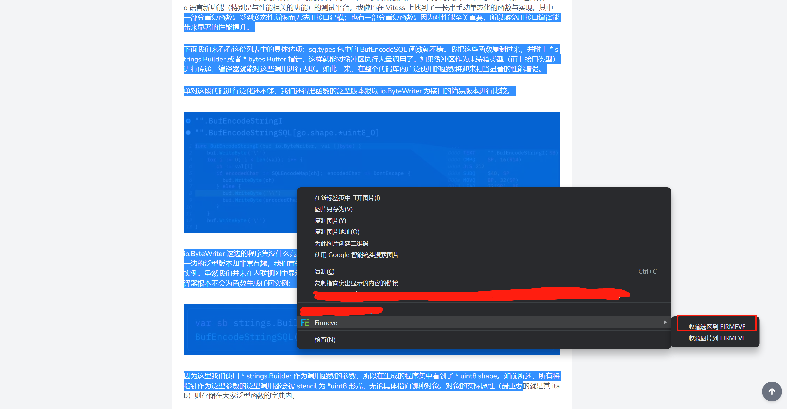
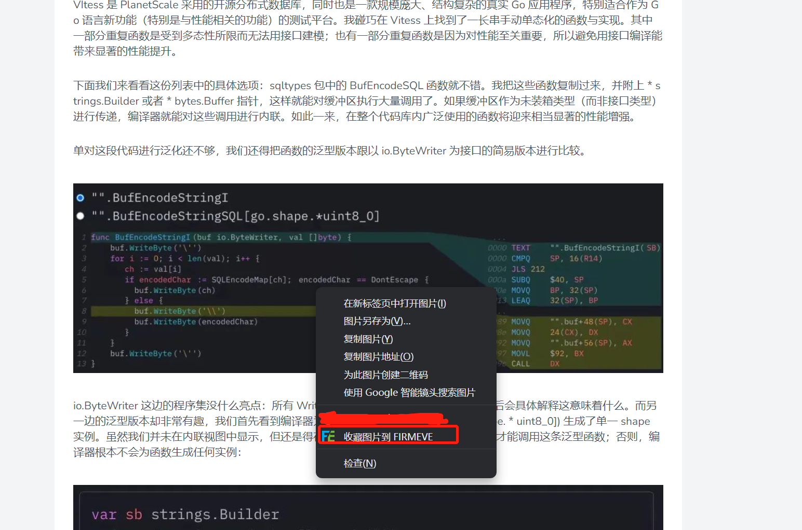

## 浏览器插件

插件安装后，一切都已准备就绪让我们快速尝试下如何使用Firmeve进行资源保存。
Firmeve 支持`网页`、`选区`、`图片`的资源保存

> 更多资源类型，正在加紧开发中，敬请期待！

### 网页内容收藏

首先我们打开我们需要保存的文章内容，右击即可轻松实现保存。

同时Firmeve也增加了快捷键保存，默认使用`ctrl+p`即可保存网页内容。

> 在您的个人配置中，支持修改其它快捷键哦！

### 选区收藏

在选区的收藏中，如果选区包含图片，Firmeve也可以轻松实现`文字+图片`的双重保存

### 图片收藏

如果我们仅仅需要收藏指定的图片，在图片上右击即可实现图片的收藏

