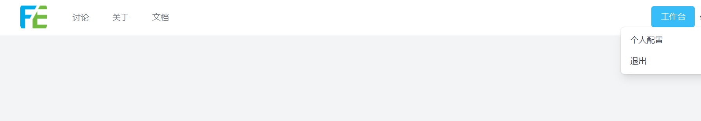

# 更新记录

## 2023-01-10

### Web 0.3.1
- 修复帐号失效 500 问题
- 支持阿拉伯语言

## 2022-12-20

### Web 0.3.0
- 全新的界面和操作更新
- 部分 Bug 修复

### 浏览器插件 0.3.3
- 增加保存分类选择
- 增加保存 Tag 添加
- 部分 Bug 修复

## 2022-10-17

### Web 0.2.1
- 历史记录增加 Host 显示
- 更安全的认证
- 增加链接类型收藏
- 收藏详情页增加个人捐赠通道（坚守不易，如果您觉得本站对您有帮助，请作者喝杯咖啡吧。）

### 浏览器插件 0.2.1
- 增加链接类型收藏
- 修复已知 Bug
- 点击插件图标跳转至 Console

## 2022-08-09

### 增加历史记录

对于新注册的用户，该特性默认是启用的。
对于已注册的用户，您可以配置中心手动启用该特性

