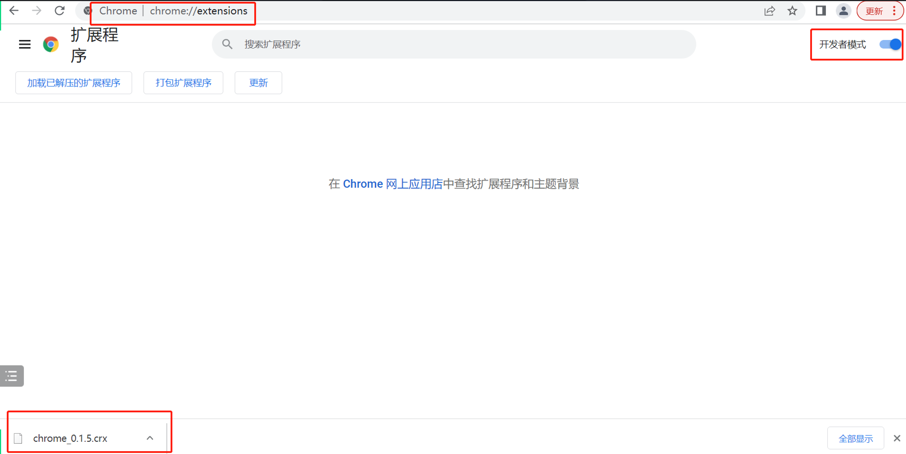

## 插件下载

### Chrome 扩展

#### 应用商店
https://chrome.google.com/webstore/detail/firmeve/mjaioceoblooamkkddmgdbcfdhneoncm

#### 手动安装
- 点击下载 `Chrome 安装包`

> 下载完成后 chrome 会有安装提示，点击信任即可。
> 
> 本插件离线安装仅仅是为了解决部分用户无法打开 `Chrome 应用商店`，提供的离线官方包。

- 在chrome浏览器地址栏输入 `chrome://extensions/` 并打开`开发者模式`

- 打开下载的crx文件，拖动到扩展程序页面，会弹出是否添加，点击添加即可

> 最后为了保障安全，可以在安装成功后关闭浏览器开发者模式。

### Edge 扩展
https://microsoftedge.microsoft.com/addons/detail/firmeve/ckblicmkgpjfmljldhgogbpknbkpcgoa

支持文章内容、片段，图片收藏

image_20220526211239.png
### Firefox 扩展

正在上架审核中，敬请期待哦！
